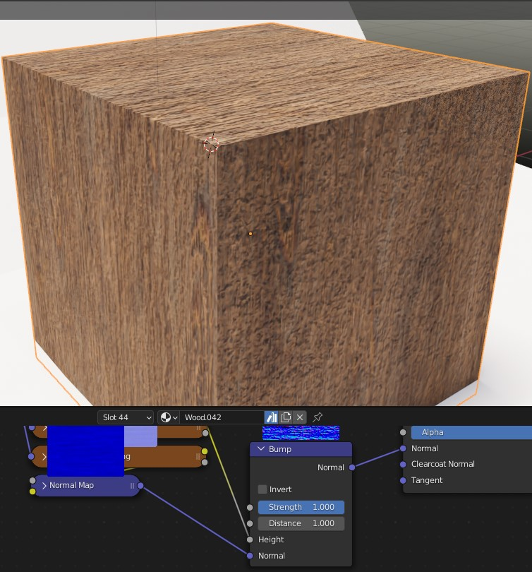
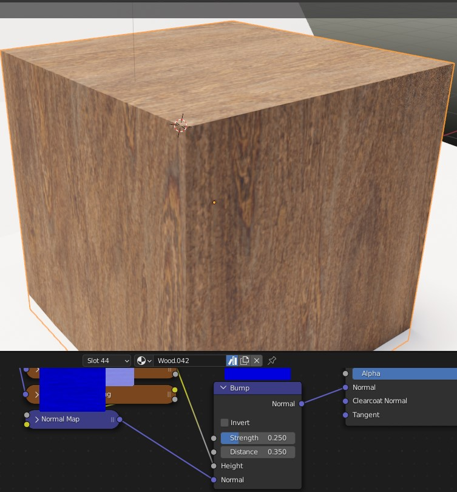
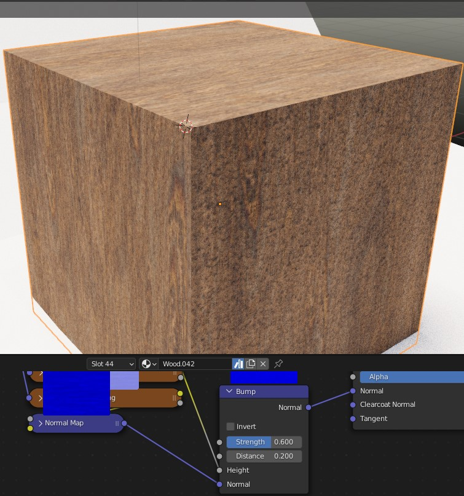
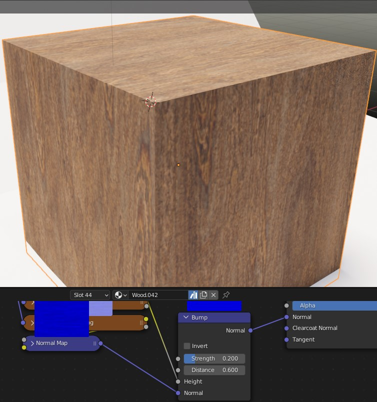

## Directory Structure

---

## Operator

You can give the created Materials/Assets a Name.
Leaving 'Material Prefix' empty will create materials with the standard blender naming convention of 'Material.XXX'.
Material Prefix = 'Street' -> 'Street.XXX'
Additionally you can set the strength and distance of the bump node.

Strength/Distance = 1 | Strength = 0.25 Distance = 0.35) | Strength = 0.6 Distance = 0.2 | Strength = 0.6 Distance = 0.6 |
| ---- | ---- | ---- |  ---- |
  |  |  | 

---

## If your textures are not loaded (RegEx customization)
I used some regular expressions to find textures with a filename that is seen in the directory structure example. If your textures are not loaded, this is probably because the regex doesn't match.

You can customize them to match your naming convention but be careful, some textures have 'rough' in their names and might break things - that's the reason for the '_' in the regex for the roughness-map -.

